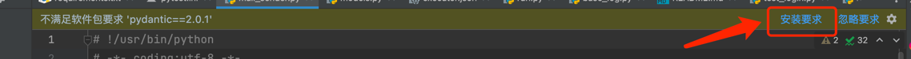

# SensoroApi

## 准备Python环境

- 安装Python>=3.10
- 安装依赖 
    - pip3 install -r requirements.txt

## 项目结构



## 配置文件

```bash
# 拷贝env文件，按照要求自行配置
cp env.example.env .env
```

## 参考文件

- [test_example.py](./intergration_tests/test_example.py)
