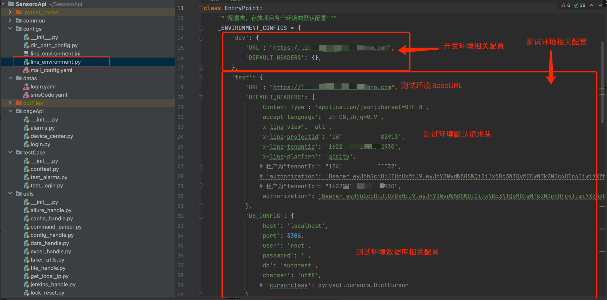
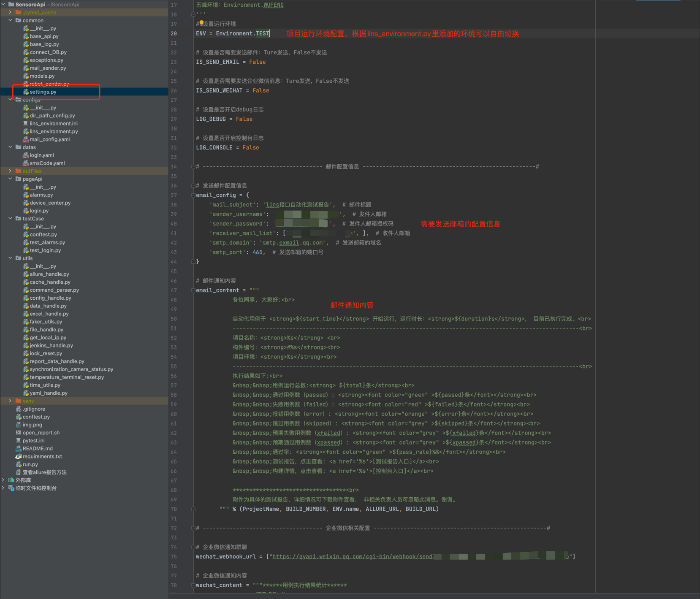
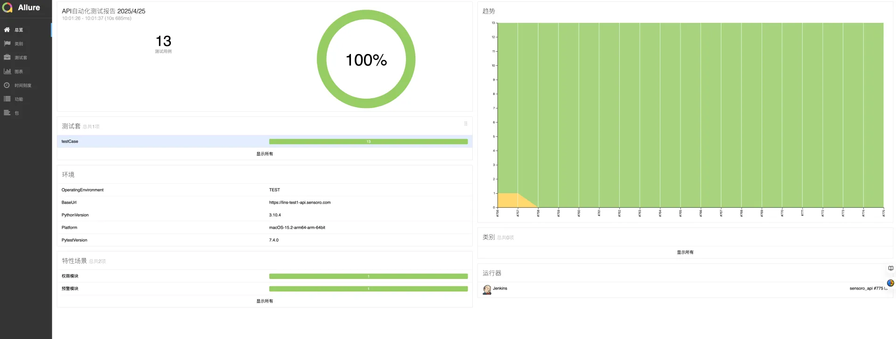
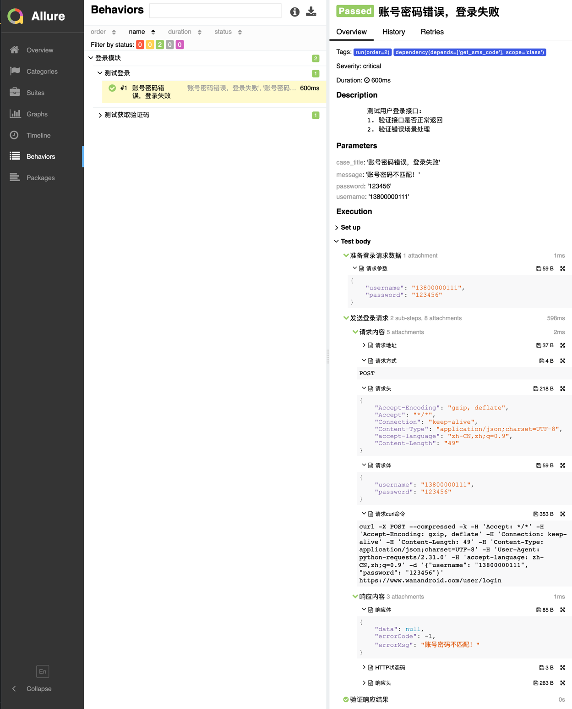
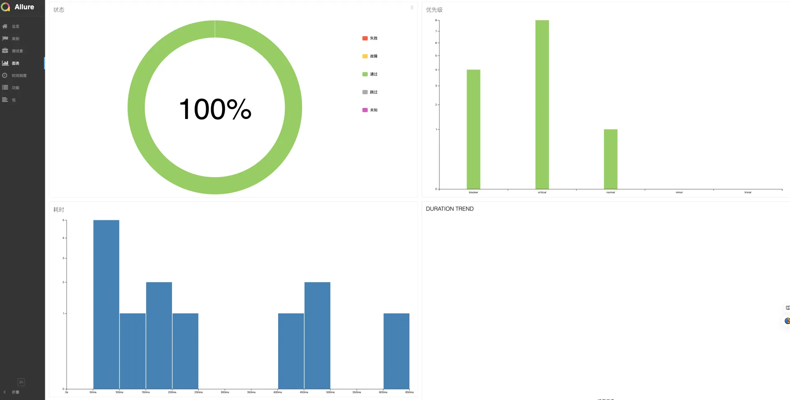
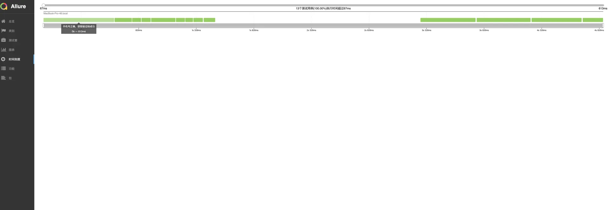

# SensoroApiAutoTest
## 联系方式：
- CSDN博客：https://blog.csdn.net/weixin_65784341?spm=1011.2415.3001.5343
- 对本框架有任何疑问均可加我微信拉你入自动化交流群(记得备注添加原因)： wj1641540482

## 实现功能：

- 测试数据隔离, 实现数据驱动
- 环境隔离：执行环境一键切换，解决多环境相互影响问题
- 支持多接口数据依赖: 如A接口需要同时依赖B、C接口的响应数据作为参数
- 对接数据库： 将数据库的查询结果可直接用于断言操作
- 消息通知：支持邮件、企业微信群、钉钉群等通知方式
- 自定义扩展方法： 在用例中使用自定义方法(如：用例中需要生成的随机数据、时间数据等，可直接调用)
- 统计接口的运行时长: 拓展功能，可以直接看到每条case的运行时长
- 多种报告随心选择：框架支持pytest-html以及Allure测试报告，可以动态配置所需报告
- 日志模块: 打印每个接口的日志信息，订制了开关，可以决定是否需要打印日志
- 自动生成用例代码: 测试人员在yaml文件中填写好测试用例, 程序可以直接生成用例代码，纯小白也能使用（待实现）
- 接口录制：录制指定包含url的接口,生成用例数据（待实现）
- 动态多断言: 如接口需要同时校验响应数据和sql校验，支持多场景断言（待实现）
- 支持swagger接口文档转成yaml用例，节省用例编写时间（待实现）
- 集成UI自动化、关键字驱动等（待实现）

## 环境准备

### 技术栈：python+pytest+requests+allure+pytest-html

- 选择语言：python>=3.10（如果是3.10以下版本的话，需要删除base_api.py中的函数返回数据格式限制，否则会存在写法不兼容问题）
- 编程工具选型：pycharm
- 测试框架选型：pytest
- 报告可视化方案选型：allure、pytest-html
- 持续集成工具：jenkins
- 仓库服务器选型：gitlab

## 安装依赖：

* 获取源码后，在pycharm终端运行以下代码，即可一键安装项目依赖：
    * ```pip3 install -r requirements.txt``` 
    * 注：如果是window系统报错 ```UnicodeDecodeError: 'gbk' codec can't decode byte 0xaa in position 65: illegal multibyte sequence```
      ，则需要先在终端执行下方的命令，将终端编码格式改为utf-8，再执行上方install命令，即可解决编码问题
        * ``` chcp 65001    ```
    * 或者直接使用pycharm自带的提示功能安装依赖包，推荐这种！！！
      


## 快速开始

### 5 分钟上手指南

**步骤 1：配置测试环境**

打开 `configs/env_config.py` 文件，修改测试环境的 URL 和默认请求头：

```python
class TestConfig:
    """测试环境配置"""
    URL = "https://your-test-api.com"  # 修改为你的测试环境地址
    DEFAULT_HEADERS = {
        'Content-Type': 'application/json;charset=UTF-8',
        'accept-language': 'zh-CN,zh;q=0.9',
    }
```

**步骤 2：准备测试数据**

在 `datas` 目录下创建 YAML 格式的测试数据文件，例如 `login.yaml`：

```yaml
- case_title: '登录成功'
  username: 'test_user'
  password: '123456'
  expected: 'SUCCESS'

- case_title: '密码错误'
  username: 'test_user'
  password: 'wrong_password'
  expected: '密码错误'
```

**步骤 3：编写测试用例**

在 `testCase` 目录下创建测试文件，例如 `test_login.py`：

```python
import allure
import pytest
from pageApi.login import Login
from common.base_api import BaseApi

@allure.feature("登录模块")
class TestLogin:
    @allure.story("登录接口测试")
    def test_login(self):
        """测试登录功能"""
        response = Login.login_app_v2(phone='13800000000', sms_code='123456')
        assert response.status_code == 200
```

**步骤 4：运行测试**

在项目根目录执行以下命令运行测试：

```bash
# 方式 1：直接运行（默认 TEST 环境）
python3 run.py

# 方式 2：指定环境运行
python3 run.py -env DEV

# 方式 3：指定环境并发送通知
python3 run.py -env TEST --send-wechat true --send-email true
```

**步骤 5：查看报告**

测试完成后，报告将生成在以下位置：
- Allure 报告：`outFiles/allure_report/index.html`
- Pytest HTML 报告：`outFiles/pytest_report/pytest_report.html`

打开浏览器访问报告文件即可查看测试结果。

## 命令行参数详解

`run.py` 支持多种命令行参数，方便在不同场景下灵活使用：

### 基本用法

```bash
python3 run.py [参数选项]
```

### 参数列表

| 参数 | 简写 | 必填 | 默认值 | 说明 |
|------|------|------|--------|------|
| `--env` | `-env` | 否 | TEST | 指定运行环境，可选值：DEV/TEST/PROD |
| `--send-wechat` | `-w` | 否 | False | 是否发送企业微信通知，可选值：true/false |
| `--send-email` | `-e` | 否 | True | 是否发送邮件通知，可选值：true/false |

### 使用示例

```bash
# 1. 默认方式运行（TEST 环境，不发送通知）
python3 run.py

# 2. 在开发环境运行
python3 run.py -env DEV

# 3. 在生产环境运行并发送企业微信通知
python3 run.py -env PROD --send-wechat true

# 4. 在测试环境运行并发送邮件通知
python3 run.py -env TEST --send-email true

# 5. 同时发送企业微信和邮件通知
python3 run.py -env TEST --send-wechat true --send-email true

# 6. 参数大小写不敏感
python3 run.py -env dev --send-wechat TRUE
```

### 注意事项

- 环境参数只支持：DEV（开发）、TEST（测试）、PROD（生产）
- 通知参数只接受：true 或 false（不区分大小写）
- 未指定环境时，默认在 TEST 环境运行
- 未指定通知参数时，企业微信默认不发送，邮件默认发送

## 环境配置说明

### 1. 环境配置文件

项目支持多环境配置，所有环境配置都在 `configs/env_config.py` 文件中管理。

### 2. 配置项说明

每个环境配置类包含以下核心配置项：

```python
class TestConfig:
    """测试环境配置"""
    
    # 接口基础 URL
    URL = "https://www.wanandroid.com"
    
    # 默认请求头
    DEFAULT_HEADERS = {
        'Content-Type': 'application/json;charset=UTF-8',
        'accept-language': 'zh-CN,zh;q=0.9',
        'authorization': 'Bearer YOUR_TOKEN_HERE',  # 如需认证可在此配置
    }
    
    # 数据库配置（用于数据库断言）
    DB_CONFIG = {
        'host': 'localhost',      # 数据库主机
        'port': 3306,             # 数据库端口
        'user': 'root',           # 数据库用户名
        'password': '',           # 数据库密码
        'db': 'autotest',         # 数据库名称
        'charset': 'utf8',        # 字符集
    }
```

### 3. 添加新环境

如需添加新的环境（如预发布环境），只需在 `env_config.py` 中添加对应的配置类：

```python
class PreConfig:
    """预发布环境配置"""
    URL = "https://pre.your-domain.com"
    DEFAULT_HEADERS = {
        'Content-Type': 'application/json;charset=UTF-8',
    }
    DB_CONFIG = {
        'host': 'pre-db.example.com',
        'port': 3306,
        'user': 'test_user',
        'password': 'your_password',
        'db': 'your_database',
        'charset': 'utf8',
    }
```

### 4. 切换环境

- **方式 1**：通过命令行参数切换（推荐）
  ```bash
  python3 run.py -env DEV    # 开发环境
  python3 run.py -env TEST   # 测试环境
  python3 run.py -env PROD   # 生产环境
  ```

- **方式 2**：修改 `common/settings.py` 中的 `ENV` 变量
  ```python
  ENV = 'DEV'  # 修改为需要的环境
  ```

### 5. 环境隔离特性

- 不同环境的配置完全独立，互不影响
- 每次运行只能选择一个环境
- 环境切换无需修改代码，只需更改配置或命令行参数
- 支持动态读取环境变量，便于 CI/CD 集成


## 项目结构

```

├── README.md                                           项目说明文件
├── common                                              公共方法类存放目录
│     ├── base_log.py                                   日志记录器
│     ├── base_api.py                                   基础类，对请求方法进行二次封装
│     ├── connect_db.py                                 数据库连接类
│     ├── exceptions.py                                 自定义报错文件
│     ├── mail_sender.py                                发送邮件方法
│     ├── models.py                                     模型定义文件
│     ├── rebot_sender.py                               发送群通知方法
│     └── settings.py                                   项目配置文件
├── configs                                             项目配置信息目录
│     ├── paths_config.py                               项目各目录路径文件
│     ├── lins_environment.ini                          项目全局环境变量配置文件（弃用）
│     └── env_config.py                                 项目全局环境变量配置文件
├── conftest.py                                         pytest共享文件，设置allure报告及其他报告的环境变量
├── datas                                               测试数据存放目录
│     ├── login.yaml                                    登录测试的数据
│     └── sms_code.yaml                                 获取验证码测试的数据
├── outFiles                                            各种输出文件存放目录
│     ├── logs                                          日志存放目录
│     ├── pytest_report                                 pytest报告存放目录
│     ├── allure_report                                 allure报告存放目录 
│     ├── Temp                                          allure报告临时存放目录
│     ├── pytest_result                                 pytest-json报告存放目录
│     └── screenShot                                    截图存放目录
├── pageApi                                             各业务接口对象类
│     └── login.py                                      登录相关接口
├── pytest.ini                                          pytest启动项配置文件
├── requirements.txt                                    python项目依赖文件
├── run.py                                              执行测试用例主入口
├── .gitignore                                          忽略提交git的文件路径
├── testCase                                            测试用例存放目录
│     ├── conftest.py                                   pytest共享文件，提供各种方法及前后置操作
│     └── test_login.py                                 登录测试用例demo
└── utils                                               测试工具存放目录
    ├── config_handle.py                                读取config配置文件的方法
    ├── allure_handle.py                                allure报告相关方法
    ├── cache_handle.py                                 全局缓存查询及使用方法
    ├── command_parser.py                               命令行定义工具
    ├── data_handle.py                                  数据模板处理及清洗方法
    ├── excel_handle.py                                 excel文件相关方法
    ├── faker_utils.py                                  mock数据工具
    ├── file_handle.py                                  文件处理相关方法
    ├── get_local_ip.py                                 获取本机ip地址方法
    ├── jenkins_handle.py                               jenkins相关方法
    ├── MIME_type_classifier.py                         获取文件MIME工具
    ├── report_data_handle.py                           项目运行结果数据处理工具
    ├── yaml_handle.py                                  yaml文件相关方法
    └── time_utils.py                                   时间转换工具类
```

## 项目代码工程构建思路：

### 1.框架设计思路

#### 1.1设计框架的原则：

- 封装基类方法
    - 对于一些较通用的方法可以进行封装，比如发送请求、增、删、改、查。
- 高内聚低耦合
    - 每个模块尽可能独立完成自己的功能，不依赖于模块外部的代码。
    - 模块与模块之间接口的复杂程度尽量低，比如在类内部尽可能减少方法之间的调用，否则一个方法的变动会影响调用它的另一个方法。
- 脚本分离
    - 业务代码、测试数据应该相互剥离、灵活调用。理念参考PO设计模式。代码中应该不出现具体的数据、配置，而是调用对应的数据文件。

#### 1.2设计项目骨架：

- 按照上述原则，采用PO设计模式及pytest测试框架，设计项目结构如下：

```
- common  #包文件，公共模块，存放一些通用方法
    - base_api.py
        - class BaseApi()#基类
            - 方法1：发送请求
            - 方法2：增
            - 方法3：删
            - 方法4：改
            - 方法5：查
- pageApi  #包文件，存放业务层代码
    - login.py #登陆模块
        - class Login(BaseApi) #继承基类里的BaseApi
            - 方法1：发送登陆请求
            - 方法2：发送登出请求
    - logout.py #登出模块
        - class Logout(BaseApi)
- configs  #包文件，存放配置
    - lins_environment.py 
    	- class EntryPoint #用于切换测试环境
        	- 方法1：获取项目URL
        	- 方法2：获取项目默认headers
        	- 方法3：获取项目默认数据库配置 
- datas #文件夹，存放数据/测试用例
    - xxx.xls
    - xxx.yaml
- testCase #包文件，存放测试用例代码,注意符合pytest命名规范
    - test_login.py
        - class Test_login
            - 方法1：test_login01
            - 方法2：test_login02
    - test_logout.py
        - class Test_logout
            - 方法1：test_logout01
            - 方法2：test_logout02
- outFiles #文件夹，输出文件
    - logs #存放项目每次运行产生的log文件
    - report #存放报告
    - screenShot #存放截图
- utils #包文件，工具类
    - handle_data.py 
    - handle_excel.py
    - handle_path.py
    - handle_yaml.py
- run.py #python文件，配置及执行测试入口
```

### 2.使用实例

#### 2.1配置项目各环境默认参数
- 在[env_config.py](configs/env_config.py)中进行各个环境相关的基础配置


#### 2.2配置项目运行相关参数
- 在[settings.py](common/settings.py)中配置项目运行的环境、通知方式、通知内容等


#### 2.3接口定义及测试用例准备

- 定义接口，在pageApi目录下设计接口对象

```python
from requests import Response
from common.base_api import BaseApi

class Login:   #定义接口对象类，同一个业务的接口放在该类下
    """登录模块"""
    def get_send_sms(phone: str, headers: dict | None = None) -> Response:   # 定义具体的接口及会用到参数
        """获取手机号验证码"""
        json = {                               # post接口可能会用到的参数，因为获取验证码接口是固定的，所以把需要的参数直接定义好了
            'mobile': phone,
            'region': 'CN'}

        return BaseApi.send_post_request('/auth/xxxx/sendSms', headers=headers, json_data=json)   # 调用基类对应的请求方法，发起具体请求


    def login_app_v2(phone: str, sms_code: str, headers: dict | None = None) -> Response:  # 定义具体的接口及会用到参数
        """移动端登录V2权限"""
        address = '/auth/xxxx/app/loginByMobile'    # 定义接口的路径，从/开始
        json = {									# post接口可能会用到的参数，因为登录接口是固定的，所以把需要的参数直接定义好了
            'mobile': phone,
            'smsCode': sms_code,
        }
    
        return BaseApi.send_post_request(address, headers=headers, json=json)      # 调用基类对应的请求方法，发起具体请求


    #注：除登录接口外，其他接口最好都定义一个headers=None的参数，防止以后需要传特殊的headers
    def select_merchant(params: dict | None = None, headers: dict | None = None) -> Response:  # 定义具体的接口及会用到参数
        """选择项目,切换scom时使用"""          
        address = '/auth/xxxx/selectMerchant'     # 定义接口的路径，从/开始
        return BaseApi.send_get_request(address=address, params=params, headers=headers)  # 调用基类对应的请求方法，发起具体请求
```

- 根据接口对象，在testCase目录下设计测试用例

```python

import os

import allure
import pytest

from common.base_api import BaseApi
from configs.paths_config import DATAS_DIR
from pageApi.login import Login
from utils.allure_handle import allure_attach_json
from utils.yaml_handle import YamlHandle

# 注：由于pytest框架规则，所有的测试用例文件名必须以test_开头或者结尾，方法名必须以test_开头，类名以Test开头或结尾

@allure.feature("登录模块测试用例")  # allure报告中展示模块功能分类的标题
class TestLogin:  # 测试类名
    # 加载测试数据
    data_sms_code = YamlHandle(DATAS_DIR + os.sep + 'sms_code.yaml').read_yaml()
    # 将获取的测试数据转换成列表套元组的格式：[(),(),()],每一个元组就是一组测试数据，其实可以不用进行这一步，我这里加了这一步是为了让allure报告的测试用例标题动态化
    params_sms = [(item['case_title'], item['expected']) for item in data_sms_code]

    data_login = YamlHandle(DATAS_DIR + os.sep + 'login.yaml').read_yaml()
    params_login = [(item['case_title'], item['username'], item['password'], item['expected']) for item in data_login]

    @allure.severity(allure.severity_level.BLOCKER)   # 设置测试用例的级别，用于在allure报告中展示，BLOCKER为阻塞级别
    @allure.story("测试获取验证码")    # allure报告中展示故事分类的标题，比allure.feature低一级
    @allure.title('{case_title}')    # allure报告中展示测试用例的标题，比allure.story低一级
    @allure.description("""
            测试获取短信验证码接口:
            1. 验证接口是否正常返回
            2.  验证错误提示信息
        """)
    @pytest.mark.run(order=1)     # 设置测试用例执行优先级的装饰器，优先级是：由小到大、由正到负、未标记的在正数后、负数前执行
    @pytest.mark.parametrize('case_title,message', params_sms)   # pytest参数化的装饰器，需要传两个参数，左边字符串内传参数名以“,”隔开，右边传具体数据，结构是[(),()]
    @pytest.mark.dependency(name='get_sms_code')     # 设置这条测试用例为主依赖用例，并且别名为get_smsCode，方便后面需要依赖该用例的用例使用
    # @pytest.mark.flaky(reruns=3, reruns_delay=2)      # 设置用例失败重试次数和重试间隔
    def test_sms_code(self, case_title, message):
        """获取验证码"""
        with allure.step("准备请求数据"):         # 添加测试步骤，在报告内展示更清晰明了
            allure_attach_json("请求参数", {"message": message})        # 添加展示在步骤内的内容  

        with allure.step("验证响应结果"):         # 添加测试步骤
            response = "获取验证码成功"            # 获取返回结果的response
            assert response == message          # 对获取的返回结果进行断言

            
    @allure.severity(allure.severity_level.CRITICAL)
    @allure.story("测试登录")
    @allure.title('{case_title}')
    @allure.description("""
            测试用户登录接口:
            1. 验证接口是否正常返回
            2. 验证错误场景处理
        """)
    @pytest.mark.run(order=2)
    @pytest.mark.parametrize('case_title, username, password,message', params_login)
    @pytest.mark.dependency(depends=["get_sms_code"], scope='class')        # 设置该用例依赖的用例，只有当依赖的用例执行成功了，这条用例才会执行，否则会跳过。scope代表查找依赖用例的范围，class代表只在当前类查找
    def test_login(self, case_title, username, password, message):
        """登录测试"""
        with allure.step("准备登录请求数据"):
            login_data = {
                "username": username,
                "password": password
            }
            allure_attach_json("请求参数", login_data)

        with allure.step("发送登录请求"):
            response = Login.login(username, password)

        with allure.step("验证响应结果"):
            response_data = BaseApi.get_json(response)
            assert response_data['errorMsg'] == message, f"接口返回错误：{response_data['message']}"

```

- 根据测试用例，在datas目录下准备测试数据

```yaml
- case_title: '手机号正确，获取验证码成功'       # yaml语法，“-”带表数组，“:”带表键值对
  phone: '13800000000'
  assertion_text: 'SUCCESS'

- case_title: '手机号格式不正确，获取验证码失败'
  phone: '12345678901'
  assertion_text: '手机号码格式不正确'

- case_title: '手机号非平台号码，获取验证码成功'
  phone: '13718395479'
  assertion_text: '账号异常①，请联系管理员'
```

#### 2.4项目运行

- 方式1：在run.py中配置需要运行的测试用例及对整个测试的一些其他配置，然后直接右键运行该文件
- 方式2：如果在Jenkins上运行，可以通过命令行启动的方式执行（此方式可以指定运行环境，是否发送通知等参数，例如：python3 run.py
  -env TEST --send-wechat True）


```python
import os
import pytest
from common.settings import  MAX_FAIL_COUNT, RERUN_COUNT, RERUN_DELAY_SECONDS
from configs.paths_config import TEMP_DIR, PYTEST_REPORT_DIR, PYTEST_RESULT_DIR

pytest.main([
    # '-q',  # 代表 "quiet"，即安静模式，它可以将 pytest 的输出精简化，只输出测试用例的执行结果，而不会输出额外的信息，如测试用例的名称、执行时间等等
    '-vs',  # 指定输出用例执行信息，并打印程序中的print/logging输出
    'testCase/',  # 执行用例的目录
    f"--maxfail={MAX_FAIL_COUNT}",  # 指定最大失败次数
    f"--reruns={RERUN_COUNT}", f"--reruns-delay={RERUN_DELAY_SECONDS}",  # 指定重运行次数和重运行间隔时间
    '--alluredir', f'{TEMP_DIR}', '--clean-alluredir',  # 先清空旧的alluredir目录，再将生成Allure原始报告需要的数据,并存放在 /Temp 目录
    f'--html={os.path.join(PYTEST_REPORT_DIR, "pytest_report.html")}',  # 指定pytest-html报告的存放位置
    '--self-contained-html',  # 将css样式合并到pytest-html报告文件中，便于发送邮件
    '--json-report', '--json-report-summary',  # 生成简化版json报告
    f'--json-report-file={os.path.join(PYTEST_RESULT_DIR, "pytest_result.json")}',  # 指定json报告存放位置
    '--capture=no',  # 捕获stderr和stdout，这里是使pytest-html中失败的case展示错误日志，会导致case中的print不打印
    # '-p', 'no:logging',  # 表示禁用logging插件，使报告中不显示log信息，只会显示stderr和stdoyt信息,避免log和stderr重复。
    '-p', 'no:sugar',  # 禁用pytest-sugar美化控制台结果
    # '-k not test_login.py',  # 不执行该文件里的case
    # '-m smoke',  # 只运行mark标记为smoke的测试用例
    '-W', 'ignore:Module already imported so cannot be rewritten'  # 忽略faker库在pytest自动导入后无法被重写警告
])
```

- run文件运行后，会根据配置的运行条件去调用testCase下对应的测试用例，也就是我们上面定义的测试用例文件
- 测试用例运行时，如果有参数化配置会去读取datas下对应的数据文件，然后会去调用pageApi里面的具体接口
- pageApi里面封装的就是具体的接口对象，此时定义的接口发起请求时，会去调用common的定制请求方法进行真正的请求，并且common里面二次封装的方法会在请求之前进行环境配置的读取。

### 3.报告展示
- 总览：

- 单个用例运行详情：

- 图表：

- 时间刻度：
